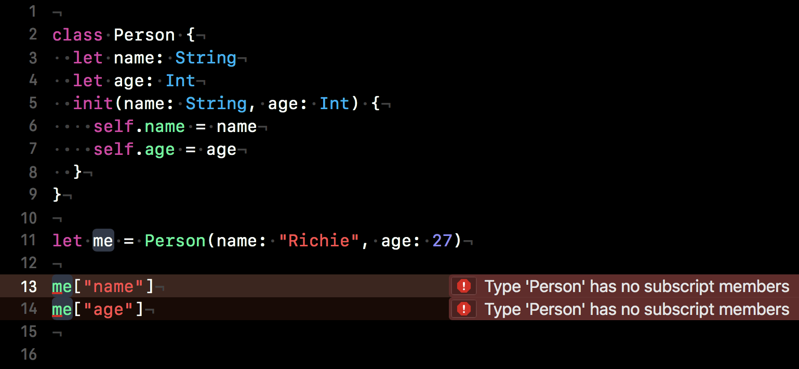

# Subscripts


Pensemos en sobreescribir el operador [] para proveer de atajos para acceder a elementos de una colección, clase, estructura o enumeración.

La sintaxis de un `subscript` es como sigue:

```
subscript(parameterList) -> ReturnType {
	get {
		// return someValue of ReturnType
	}
	set(newValue){
		//set someValue of ReturnType to new Value
	}	
}
```

Un `subscript` se parece tanto a una `función` y de un `computed-property`.

* Se pueden tener `variadic parameters`, pero no es posible usar `inout` o `default`parameters. Tampoco pueden arrojar errores.

Vemos que tienen tanto setter como getter, el setter es opcional, por lo tanto el subscript puede ser tanto de lectura-escritura o solo de lectura.

El valor `newValue` del setter puede ser omitido.

*Ejemplo*: Agreguemos un `subscript` a la clase `Persona`:


``` Swift
class Person {
  let name: String
  let age: Int
  init(name: String, age: Int) {
    self.name = name
    self.age = age
  }
}
```
``` Swift
let me = Person(name: "Richie", age: 27)
```
Ahora intentemos acceder a sus valores con:

```
me["name"]
me["age"]
```
Pero pero pero... Xcode te arroja un error:

>  Type "Person" has no subscripts members



Claro, no se ha definido ningún Subscript, definamos uno:

``` Swift
extension Person {
	subscript(key: String) -> String? {
		switch key {
			case "name":
				return name //String
			case "age":
				return "\(age)" // Int
			default:
				return nil
		}
	}
}
```

Ahora si, ya funciona:


