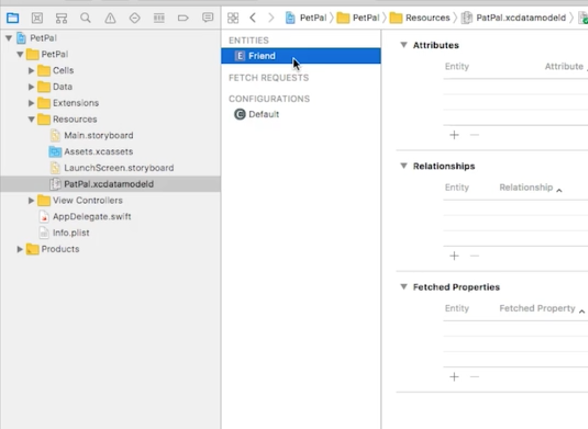
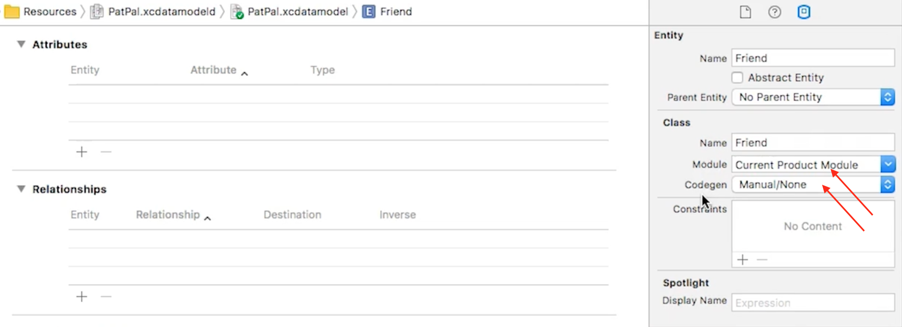
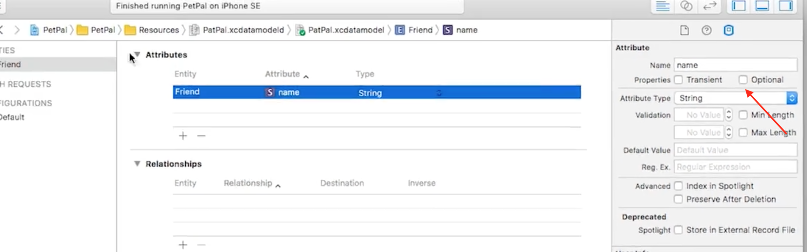
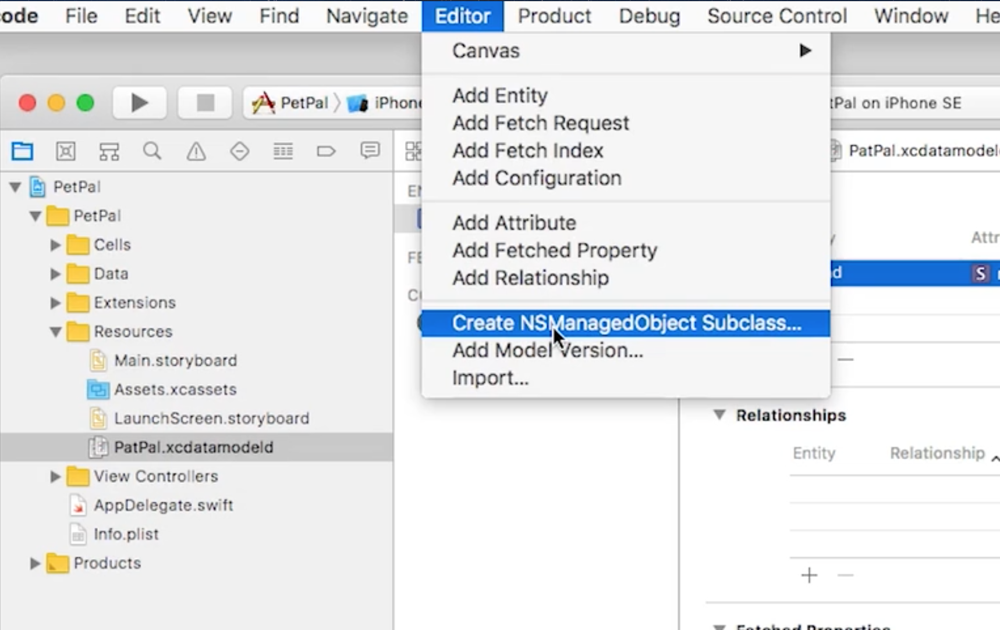
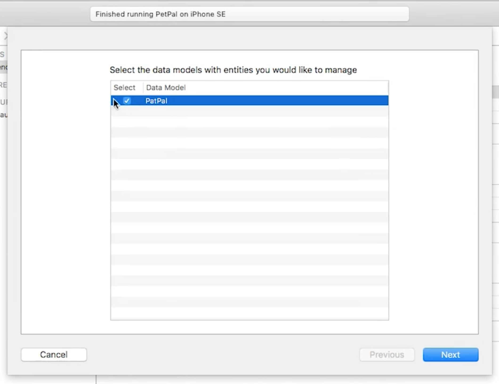
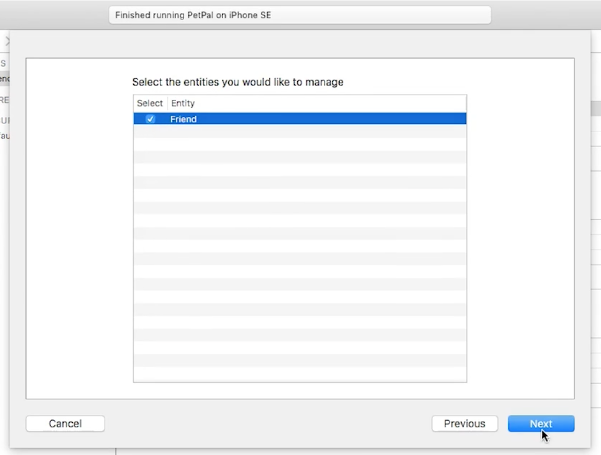
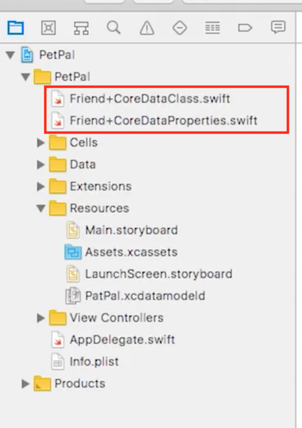

# Coredata

Como agregar Core Data una vez que se ha creado el proyecto.

## Integrar CoreData en una App

**Right Click (on resources folder) > New File > Core Data > Data Model > Next > "Name it" > Create.**

## Basics

### Agregamos una Entidad

**Entity** es un CoreData Class.

Seleccionamos el CoreData Model (.xcdatamodeld).

**Add Entity > "Name it" (ej. Friend)**, con este Entity representaremos a nuestros amigos.

**Codegen:** crea el código por nosotros.

**Attributes:** Pondremos "name" de tipo "String" y seleccionamos que el Attribute no es de tipo Optional.

Ahora, generaremos las clases de CoreData.

Vamos al siguiente menu **Editor > Create NSManaged Object Subclass...**

Luego seleccionamos los Modelos y Entidades que deseamos manejar, y presionamos Create.

Y vemos como crea nuevas clases de Core Data, en estas clases basicamente editamos el CoreDataClass, el CoreDataProperties se quedaria asi como esta.

 
 