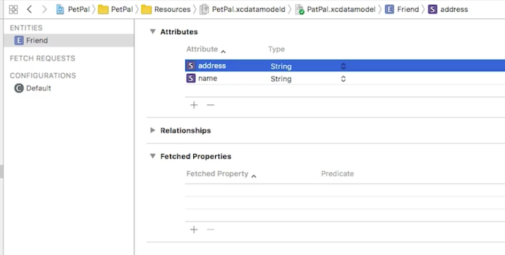

# Coredata

## Managed Objects

Las clases heredan de la clase **NSManagedObject**.
Y notifica cuando el objeto cambia o si el objeto va a ser borrado o guardado.

> CoreData Properties: Son generados cada vez que se genera un nuevo CoreData Class.

Para guardar una instancia de **NSManagedObject** necesitamos usar **Managed Object Context**, esto es como una especie de *Data Manager*.

* **NSManagedObject** siempre va de la mano con un **ManagedObjectContext**.

Pero, necesitamos de **Persistent Store Container** para poder guardar instancias de nuestras clases.
**Persistent Store Container** es quien tiene la referencia del archivo de BD.

## Como implementar esto

Importamos `import CoreData` en el *AppDelegate.swift*, y declaramos el *persistanceContainer*, este container tendra el nombre de nuestro modelo *PetPal.xcdatamodel*.


Ahora si, el código, como leer el Modelo, guardar datos y recuperarlos.

```Swift
import CoreData

//Class ..... {

//Declaramos una variable para tener el modelo 
lazy var persistentContainer: NSPersistentContainer = {
	let container = NSPersistentContainer(name: "PetPal") 
	container.loadPersistentStores(completionHandler: {
		(storeDescription, error) in
		print(storeDescription)
		if let error = error as NSError? {
			fatalError("Message")
		}
		})
		return container
	}()
	
//Creamos un metodo para guardar nuestro Managed Context
func saveContext(){
	let context = persistentContainer.viewContext
	if context.hasChanges {
		do {
			try context.save()
		} catch {
			let error = error as NSError
			fatalError("Message")
		}
	}
}	

// Delegate methods...

}//end class
```

Ahora, en nuestro **ViewController**, creamos por ejemplo arrays de tipo **Friend**.

```Swift
//Recordemos como esta definido Friend dentro de Friend+CoreDataClass.swift
import Foundation
import CoreData

public class Friend: NSManagedObject {

}
```
Definimos nuestros arrays de tipo **Friend**, y creamos dos referencias, una al AppDelegate y otra al Context.

```Swift

class ViewController:UIViewController {

	private var friends = [Friend]()
	private var filtered = [Friend]()

	//Creamos una referencia al AppDelegate y al Context
	private var appDelegate = UIApplication.shared.delegate as! AppDelegate
	private let context = (UIApplication.shared.delegate as! AppDelegate).persistentContainer.viewContext
	
	//Fetch request
	override func viewWillAppear(_ animated: Bool) {
		super.viewWillAppear(animated)
		do {
			//return an array of friends
			friends = try context.fetch(Friend.fetchRequest())
		}catch let error as NSError {
			print("Could not fetch")
		}
	}
	
	//Create a Friend in CoreData
	func addFriend(){
		
		let data = FriendData()
		let friend = Friend(entity: Friend.entity(), insertInto: context)
		friend.name = data.name
		appDelegate.saveContext()
		
		// ahora talacha...
		// guardar el friend en el array global y actualizar el CollectionView o TableView
		friends.append(friend)
		let index = IndexPath(row:friends.count - 1, section:0)
		collectionView?.insertItems(at: [index])
	}
	
	//Usar nuestro Friend agregado
	func collectionView(_ collectionView: UICollectionView, cellForItemAt indexPath: IndexPath) -> UICollectionViewCell {
	
	let cell = ....bla bla bla
	cell.nameLabel.text = friend.name!
	return cell
	}
	
	//SearchBar 
	func searchBarSearchButtonClicked(_ searchBar: UISearchBar){
		
		guard let query = searchBar.text else {
			return
		}
		filtered = friends.filter({(friend) -> Bool in
			return friend.name!.contains(query)
		})
		
		//reloaddata
	}
```

## Agregar mas attributes

Vamos a nuestro modelo, seleccionamos nuestro Entity y agregamos el Attribute que necesitemos, en este caso *address*.



Vamos a necesitar **Eliminar** nuestra clase de **Properties** y volverla a generar, eliminamos **Friend+CoreDataProperties.swift**.

Ahora generaremos nuevamente la clase, seleccionamos el modelo *PetPal.xcdatamodel* y en el menú *Editor > Create NSManagedObject Subclass...*


Esto generará nuevamente la clase, pero ahora el contenido cambia.


Ahora faltaria editar el ViewController, basicamente se implementa igual que `friend.name`, o sea, `friend.address`.


 # Referencias

 https://medium.com/@ankurvekariya/core-data-crud-with-swift-4-2-for-beginners-40efe4e7d1cc
