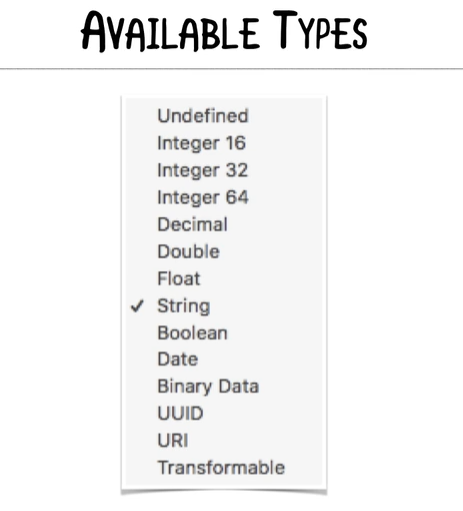
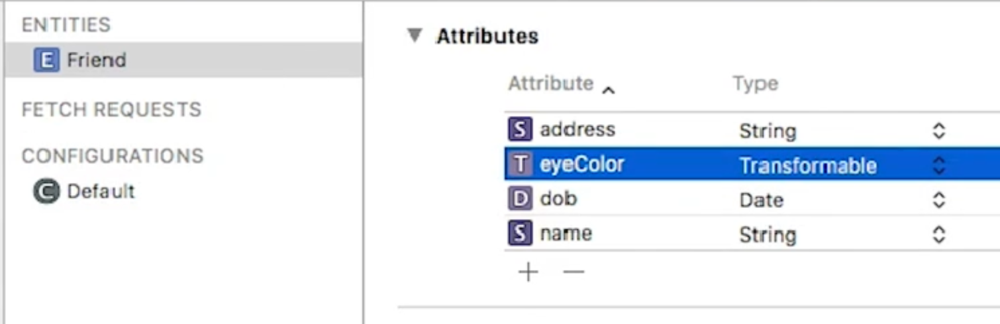
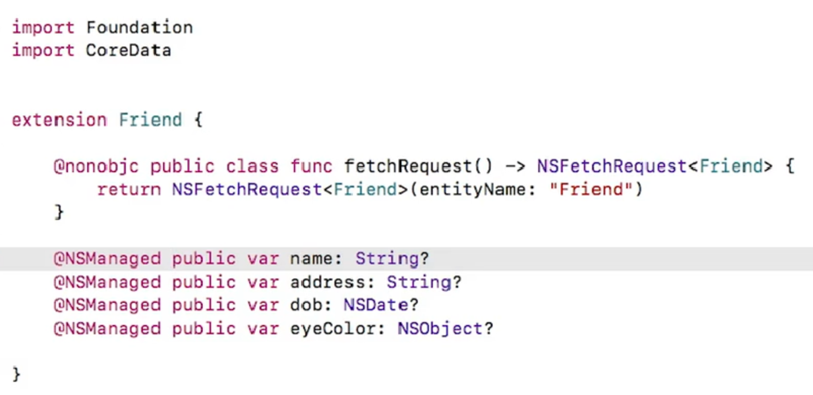

# Coredata

## Attributes



Un Attribute es por defecto *Undefined*, CoreData necesita saber el tipo de dato para poder guardar data en él.

Un *Undefined Transient* es simplemente un *NSObject*.

**Binary Data** es simplemente **NSData** y se guarda directamente en CoreData.

**Transformable:** es un tipo de dato que se convierte a un **NSObject** y luego se guarda como un NSData. Este implementa la operación de Serialize y Deserialize pero es necesario hacer *cast* al objeto para poder acceder a él.

>Ejemplo, agreguemos dos Attributes al Model *eyeColor* y *dob*.



Actualizamos el `Friend+CoreDataProperties.swift` y vemos el nuevo código generado (vemos que es de tipo NSObject):



Esto nos permite por ejemplo poder guardar un **UIColor** en la variable de **eyeColor**, este color se transformará automáticamente en **NSData**, no hay que hacer nada al respecto.

```Swift
//Del ejemplo del código de Friends
let cell = ...
let friend = .......
cell.nameLabel.text = friend.name!
cell.addressLabel.text = friend.address
cell.ageLabel.text = "Age: \(friend.age)" //<-- OJO
cell.eyeColorView.backgroundColor = friend.eyeColor as? UIColor

if let image = images[friend.name!] {
	cell.pictureImageView.image = image
}
```

Nota: `friend.age` es obtenido del siguiente código;

```Swift

import Foundation
import CoreData

public class Friend: NSManagedObject {

	var age: Int {
		if let dob = dob as Date? { //dob es el Attribute del Model
			return Calendar.current.dateComponents([.year], from:dob, to: Date()).year!
		}
		return 0
	}
}
```


