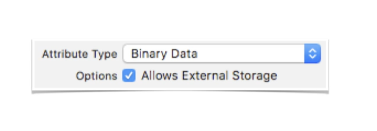
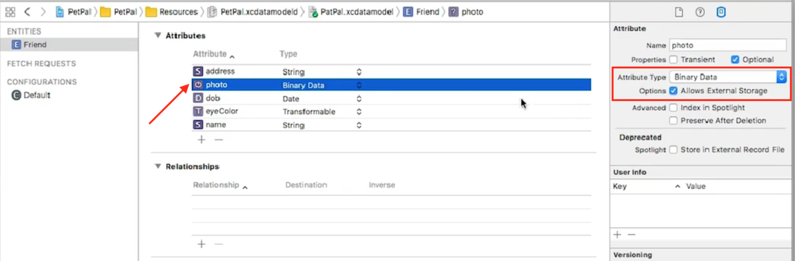

# Binary Data

Que pasa si decidimos guardar una foto en CoreData, bueno, podemos agregar un Attribute que lo almacene. Este Attribute debe ser de tipo *Binary Data*.

Y que pasa si queremos guardar datos muy grandes, bueno, necesitamos indicarle que lo almacene en el *External Storage*.




## Agreguemos una foto al Model

En el Modelo, agregamos un nuevo attribute de tipo Binary Data, luego en el panel de prefs. habilitamos Allow External Storage.




```Swift
//Al implementar el Attribute, sería algo como esto:

//Guardamos la imagen:
friend.photo = UIImagePNGRepresentation(image) as NSData?
appDelegate.saveContext()

//Para leer la imagen:
if let data = friend.photo as Data? {
	cell.pictureImageView.image = UIImage(data:data)
}else{
	cell.pictureImageView.image = UIImage(named: "placeholder")
}
```
