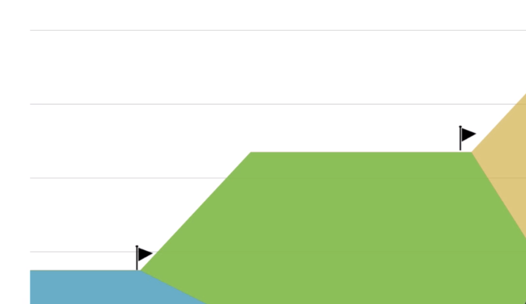
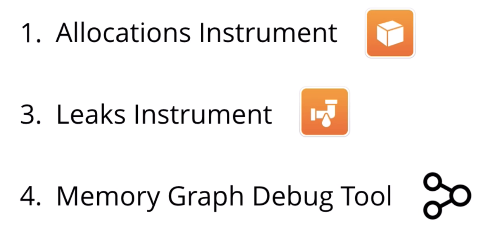
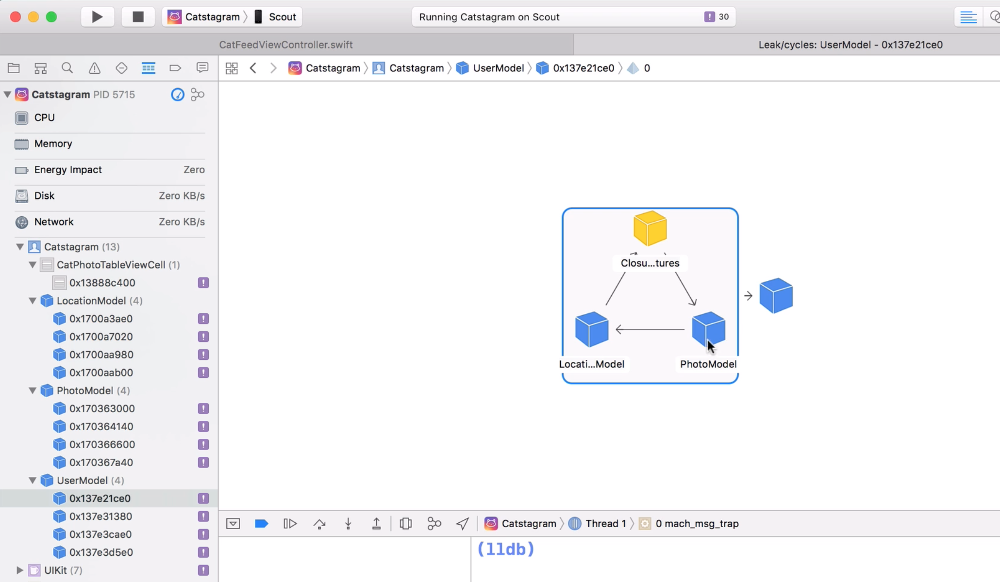
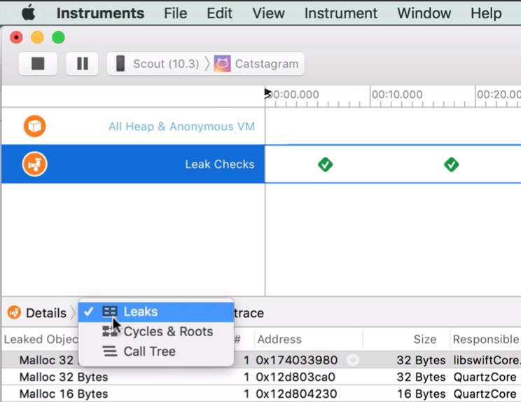
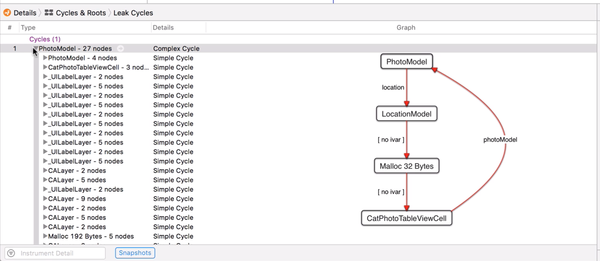
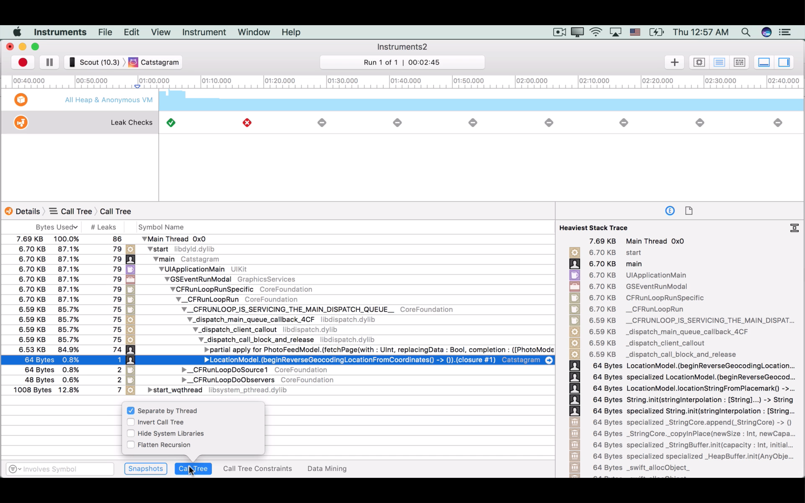

# Memory

Automatic Reference Counting, mantiene la cuenta de cuantas referencias tiene un objeto a su apuntador.

Si esta cuenta llega a cero ARC lo libera de memoria.

Retain Cycle, es algo que no puede controlar ARC pero al utilizarlo podemos saber si existe alguno.

Un retain cycle es como el meme de spiderman señalandose uno al otro. 

*Esto significa que si un objeto1 que apunta a un objeto2 y este objeto2 apunta al objeto1, despues el objeto1 es eliminado de memoria, el objeto2 deberia morir tambien. Si existe un strong reference, entonces sigue pensando que obj1 existe cuando no es así.*


# Memory Leaks

Al analizar la app y asegurarnos de que no haya memory leaks,
podemos usar un Generational Analysis.

**¿Como hacemos esto?**

Bueno, una vez ejecutada la app, agregamos una bandera (initial state), luego vamos a otra vista de la app, agregamos otra bandera, y regresamos a la vista inicial.

Los niveles de la bandera deben ser iguales que al principio, sino es así, entonces tenemos un *Memory Leak*.



Tenemos varias herramientas para esto.

Allocations Instrument: Hace un tracking de los objetos que la app almacena (allocates) mientras se va ejecutando.
El instrumento muestra cuanta memoria ha sido utilizada para almacenamiento en **mebibytes** osea **megabytes**.


Leaks Instrument, busca memory leaks cada 10 segundos.

Memory Graph Debug Tool, un boton de tres circulitos que te dice que *objetos* siguen aun vivos y te ayuda a encontrar pequeños retain cycles rapidamente.




## Memory Leaks utilizando Memory Graph Debug Tool

En la parte izquierda vemos un icono morado de exclamación **!**. Estos son nuestros memory leaks encontrados, al seleccionar uno vemos que efectivamente los objetos tienen una referencia unos con otros y crean un ciclo.




En la imágen se ve que **PhotoModel** es uno de los culpables de este retain cycle.

Revisando su código vemos el objeto `var location: LocationMode?`.

Y en conjunto vemos que `photoModel.location` tiene un closure, 
este closure retiene la referencia.

```
func reverseGeocodedLocation(completion: @escaping ((LocationModel) -> Void)) {
        if placemark != nil {
            completion(self) // <- se retiene a si mismo adentro
        } else {
            placeMarkCallback = completion // <- se retiene como variable global
            if !placeMarkFetchInProgress {
                beginReverseGeocodingLocationFromCoordinates()
            }
        }
    }
```

En swift al utilizar un closure tenemos algo llamado `capture list`, este capture list permite hacer algunas referencias `weak` si estamos utilizando un bloque.

```
func reverseGeocode(locationForPhoto photoModel: PhotoModel) {
        photoModel.location?.reverseGeocodedLocation(completion: { (locationModel) in
            self.photoLocationLabel.attributedText = photoModel.locationAttributedString(withFontSize: 14.0)
            self.photoLocationLabel.sizeToFit()
        })
    }
```

Convertimos las referencias a `weak`, ahora el objeto `photoModel` debe ser tratado como `optional`, agregamos `[weak photoModel]`:

```
func reverseGeocode(locationForPhoto photoModel: PhotoModel) {
        photoModel.location?.reverseGeocodedLocation(completion: { [weak photoModel] (locationModel) in
            self.photoLocationLabel.attributedText = photoModel?.locationAttributedString(withFontSize: 14.0)
            self.photoLocationLabel.sizeToFit()
        })
    }
```

## Leaks en Instruments


Al elegir **LEAKS** como el instrumento, tendremos verificacioens cada 10 segundos, si la prueba pasa aparecera un CheckMark en Verde.

En la tabla de abajo, podrian aparecer Retain Cycles, con el nombre de *Malloc <bytes>*.

Adicionalmente, tenemos en *DETAILS* opciones para ver estos Retain Cycles.




Podemos ver los Cycles graficamente en la opcion **Cycles & Roots**:





Al encontrarnos con un LEAK, aparecera en ROJO en el timeline.
Con la opcion de Call Tree podemos encontrar que linea de código, funcion, o clase es aquella que esta causando problemas.
Recuerda siempre buscar por MAIN.





