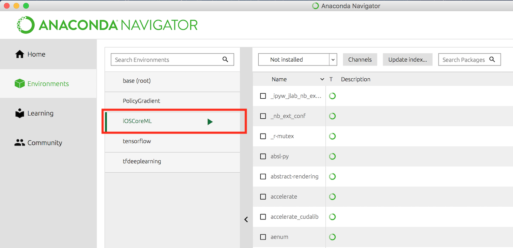

#Machine Learning with Scikit-learn


**Core ML framework** te permite integrar modelos de ML entrenados dentro de la App. Apple permite convertir muchos formatos de ML a su formato `.mlmodel`.

Veamos como crear y entrenar un modelo de ML con *Python* y utilizando `scikit-learn` para después integrarlo dentro de una app de iOS via **Core ML framework** . 

## Iniciamos...

- Creamos un **Conda Environment** (ej. iOSCoreML) e iniciamos la terminal (dando play).



- Instalamos **Pandas** (puedes hacerlo directamente desde Anaconda).

- Instalamos el Paquete de **CoreML** de Apple:
> pip install -U coremltools

- Tambien debemos tener instalado **SciKit**:
> conda install scikit-learn


## Time to code...
**Support vector machines**: 
> Support vector machines work in different ways and may or may not be appropriate for your data. One of the hardest parts of machine learning is finding the right model and the right parameters for that model to get the best results.

Crearemos un **Modelo de Regresión lineal** para predecir ganancias por publicidad, utilizaremos *Jupyter* notebook.

Dentro de este Notebook tenemos que `import coremltools` nos permitirá crear el modelo para **CoreML de iOS**. Además, el método `coremltools.converters.sklearn.convert` tiene los sig. parámetros:

- El `scikit-learn model` que será convertido.
- Los nombres de `Input` y `Output` para que Xcode genere las `clases` en Swift.
- Finalmente, `save()` exporta todo con el nombre especificado con la extensión `.mlmodel`.


​

Una vez generado el modelo de CoreML, lo copiamos en nuestro proyecto de Xcode.

​

Nos dirigimos a nuestro **ViewController.swift**, ahi escribiremos el siguiente código:

``` Swift
//ML Model
//Crearemos una usando un Modelo de Regresión lineal para predecir ganancias por publicidad

//Variable global:
private let advertising = Advertising()

//...Dentro de sliderValueChanged()
let input = AdvertisingInput(tv: tv, radio: radio, newspaper: newspaper)
guard let output = try? advertising.prediction(input: input) else {
   return
}
let sales = output.sales
```

### El código del modelo en Python...

```python
import pandas as pd
import sklearn.model_selection as ms
import sklearn.linear_model as lm
import sklearn.svm as svm
import coremltools
```
```python
# Read the data from csv file
adver = pd.read_csv("Advertising.csv", usecols=[1,2,3,4])
adver.head()
```
<div>
<style scoped>
    .dataframe tbody tr th:only-of-type {
        vertical-align: middle;
    }

    .dataframe tbody tr th {
        vertical-align: top;
    }

    .dataframe thead th {
        text-align: right;
    }
</style>
<table border="1" class="dataframe">
  <thead>
    <tr style="text-align: right;">
      <th></th>
      <th>TV</th>
      <th>radio</th>
      <th>newspaper</th>
      <th>sales</th>
    </tr>
  </thead>
  <tbody>
    <tr>
      <th>0</th>
      <td>230.1</td>
      <td>37.8</td>
      <td>69.2</td>
      <td>22.1</td>
    </tr>
    <tr>
      <th>1</th>
      <td>44.5</td>
      <td>39.3</td>
      <td>45.1</td>
      <td>10.4</td>
    </tr>
    <tr>
      <th>2</th>
      <td>17.2</td>
      <td>45.9</td>
      <td>69.3</td>
      <td>9.3</td>
    </tr>
    <tr>
      <th>3</th>
      <td>151.5</td>
      <td>41.3</td>
      <td>58.5</td>
      <td>18.5</td>
    </tr>
    <tr>
      <th>4</th>
      <td>180.8</td>
      <td>10.8</td>
      <td>58.4</td>
      <td>12.9</td>
    </tr>
  </tbody>
</table>
</div>


```python
X, y = adver.iloc[:, :-1], adver.iloc[:, -1] #y is sales column, X the others
```


```python
X_train, X_test, y_train, y_test = ms.train_test_split(X, y, test_size=0.25, random_state=42)
```


```python
regr = lm.LinearRegression()  # 1, creating lin. reg. model obj.
regr.fit(X_train, y_train)    # 2, the fit method always trains the model
regr.score(X_test, y_test)    # 3, the score is what determines how good the model is. 
```


    0.8935163320163659


```python
# Columnas   TV  Radio  Newspaper
X_new = [[ 50.0, 150.0, 150.0],
         [250.0,  50.0,  50.0],
         [100.0, 125.0, 125.0]]
regr.predict(X_new)
```


    array([34.15367536, 23.83792444, 31.57473763])


```python
# New prediction witch Support Vector Machine
svr = svm.LinearSVR(random_state=42)
svr.fit(X_train, y_train)
svr.score(X_test, y_test)
```


    0.8665383823569165


```python
svr.predict(X_new)
```


    array([25.86174666, 21.5094961 , 24.77368402])


```python
input_features = ["tv", "radio", "newspaper"]
output_feature = "sales"

model = coremltools.converters.sklearn.convert(regr, input_features, output_feature)
model.save("Advertising.mlmodel")
```


## Referencias

[Linear Regresion notas](https://github.com/richimf/TensorFlowCodes/blob/master/Linear%20Regresion.md)

[Beginning ML Sckit Learn Raywenderlich](https://www.raywenderlich.com/180830/beginning-machine-learning-scikit-learn)


