# Autolayout

**Constraint:**
Es una regla que define las relación entre `Views`, por ejemplo que el `Height` y el `Width` tengan el mismo valor.

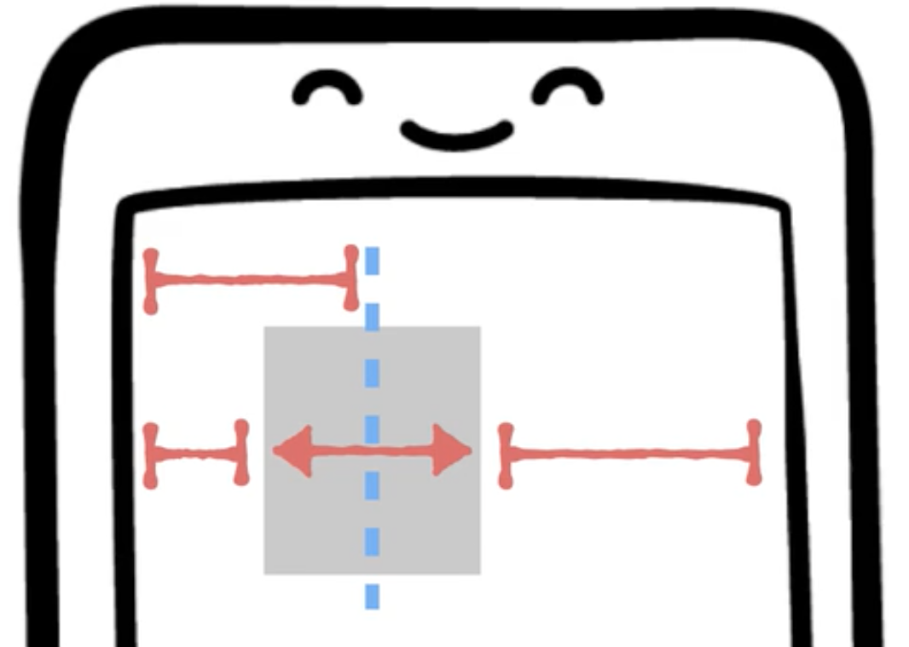

**Auto Layout Formula:** 
En el siguiente ejemplo se puede ver un `Subview` que siempre será de la mitad de tamaño que el `SuperView` contenedor.

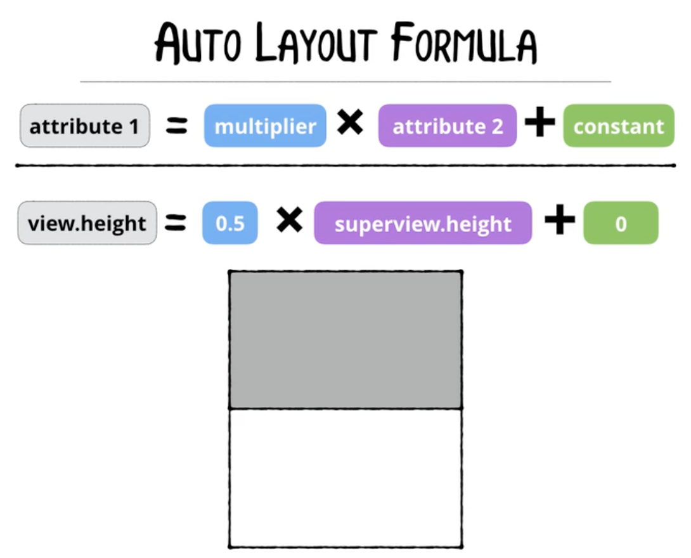

Y en el siguiente, especificamos que el tamaño de un botón sera de **50**, vemos que nuestro *attribute2* es `NSLayoutAttribute.notAnAttribute(0)`, este valor será cero.

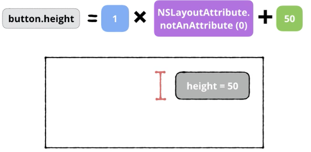

## Terms

**Leading y Trailing:**
Debemos definir si el sentido de orden será de Izquierda a Derecha o visceversa.
Definimos primero **Leading**.

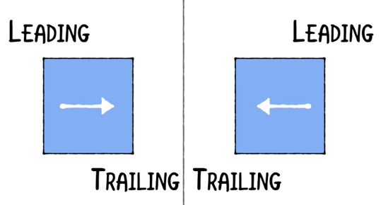


## Constraints

**Add New Constraints Button:** 
Aquí especificamos constraints, como el Height, Width y reglas como Equal Widths/Heights, también para especificar constraints respecto a los margenes.

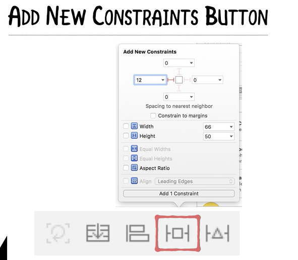


**Minimum Font Scale:** Cambia la escala de la letra en los *Labels*, por ejemplo si no cabe el texto en una pantalla pequeña iPhone SE, podemos especificar una escala minima.

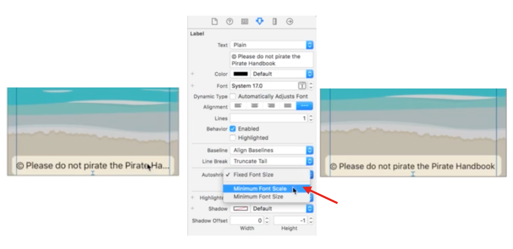


## Mostrar mas de un Device en la pantalla

Podemos ver mas pantallas para verificar los constraints, esta pantalla se puede rotar. Para ello seguimos los sig. pasos:

	1.- Abrimos el Assitant Editor
	2.- Seleccionamos Preview
	3.- Luego agregamos + el Device que necesitemos
	
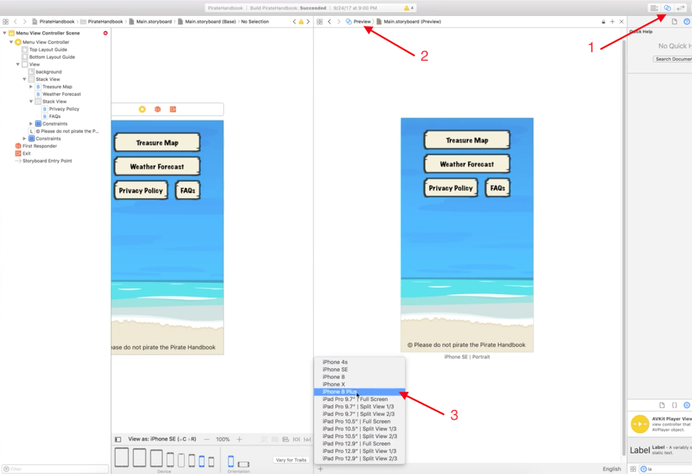

Asi podemos tener el iPhone X a la izquierda y el iPhone SE y 4S a la derecha.

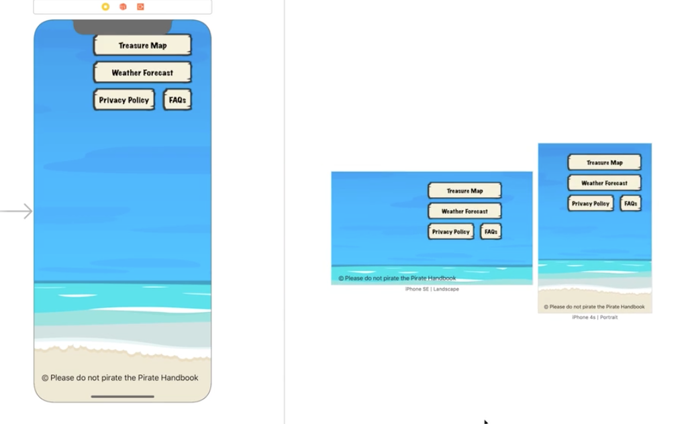


## Dragging Constraints

Es un atajo que podemos usar al presionar **Control + Click**.

Nota: debemos notar que al hacer Drag de manera Diagonal es diferente que si hacemos Drag de manera vertical u horizontal, las opciones cambian.

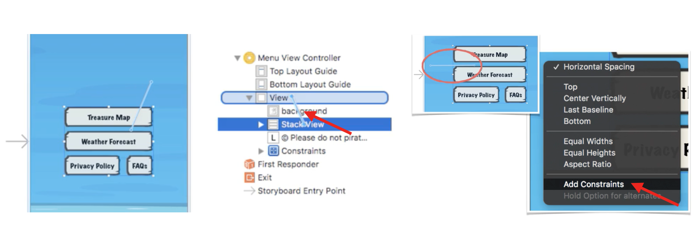

Nota: Si usamos alguna opción de Arrange de este menú, **NO** se crean Constraints:

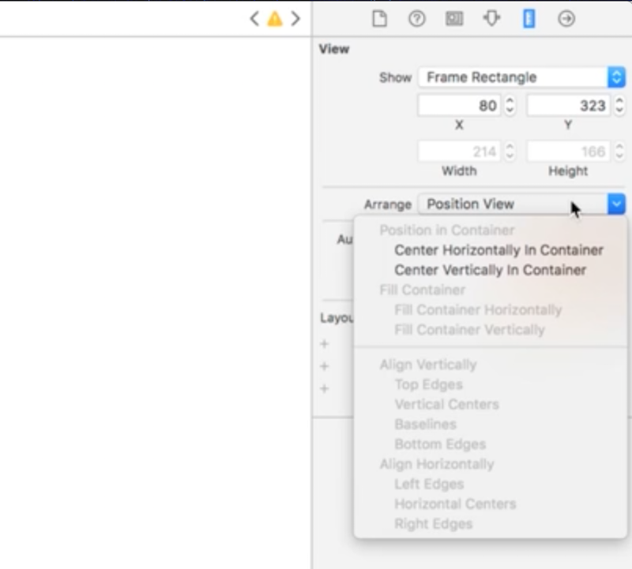

Ejemplo, para preservar la posición del Stack View en el centro de la pantalla:

	1.- Control + Click y seleccionamos el View contenedor.
	2.- En las opciones del menu elegimos Center Horizontally in Container y Center Vertically in Container.
	3.- Finalmente las agregamos con Add Constraints.
	
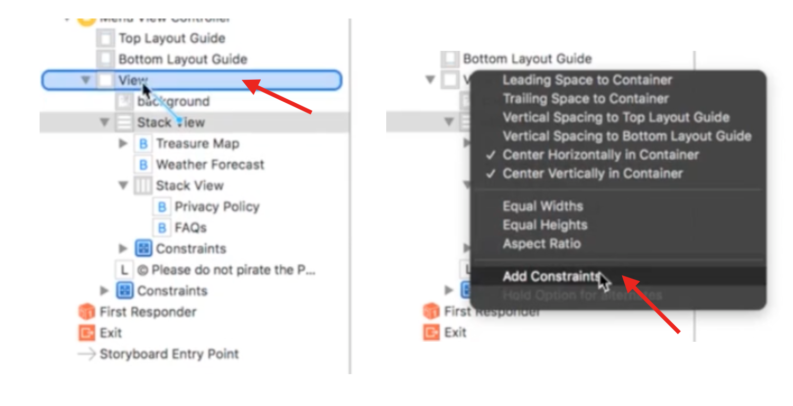

Así aseguramos que los Views esten centrados.

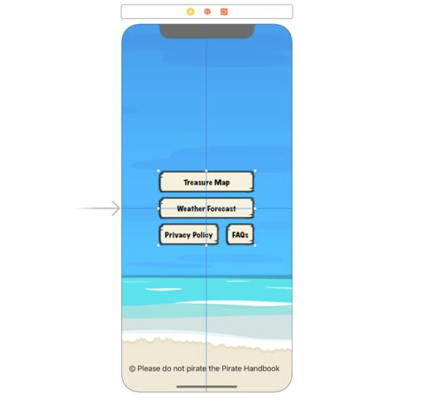


## Tips
	*  Evitar valores fijos fixed Width and Height, ya que no se pueden ajustar los valores en el futuro.
	*  Usar el valor mas alto para StackViews, ej. >1000 para individual constraints.
	*  Combinar StackViews con Constraints.
  

# Autoresizing

Con Autoresizing podremos centrar un fondo o un boton, pero si este elemento cambia su tamaño, NO tendra entendimiento de que lo quiere centrado, para ello necesitamos usar Constraints.

**Autoresizing Attributes:** 
Fixed o Flexible.
Fixed = no va a cambiar.
Flexible = Cambiara proporcionalmente.

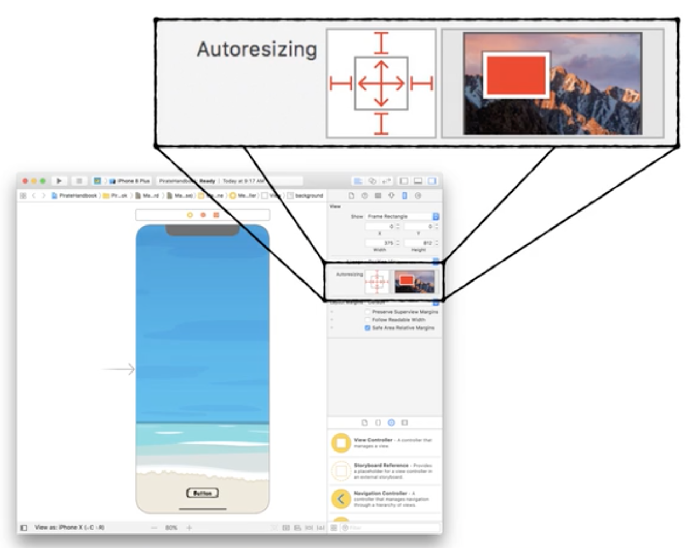

**Autoresizing** no puede manejar el siguiente escenario (evitar que se traslapen dos views), para ello utilizamos **Autolayout**:

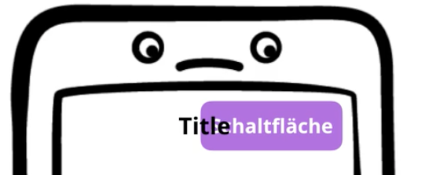

Hay una propiedad dentro de **UIView** que traduce **Autoresizing Masks** en **Constraints** si estas **Views** fueron creadas en **Interface Builder** con Constraints definidos.
Esta propiedad es `false` por defecto, sin embargo, si creaste las UIViews por código es `true`.

``` Swift
	let view = UIView()
	view.translatesAutoresizingMaskIntoConstraints = false
```

AutoresizingMask no es nada mas que Autoresizing Felxibilities, es unicamente la manera en la que podemos ser flexibles.

``` Swift
	//Ejemplo de código de typealias para Autoresizing
	extension UIView {
		typealias AutoresizingOptions = UIViewAutoresizing
	}
	
	UIView.AutoresizingOptions.flexibleLeftMargin
	UIView.AutoresizingOptions.flexibleWidth
	UIView.AutoresizingOptions.flexibleLRightMargin
	
	UIView.AutoresizingOptions.flexibleTopMargin
	UIView.AutoresizingOptions.flexibleHeight
	UIView.AutoresizingOptions.flexibleBottomMargin
```

Con **Autoresizing** podemos ajustar Views, por ejemplo el fondo para que sea compatible con varios dispositivos.

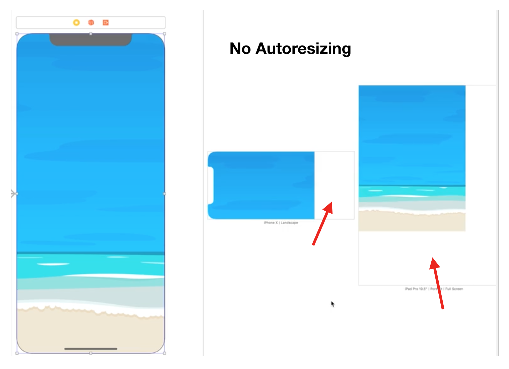

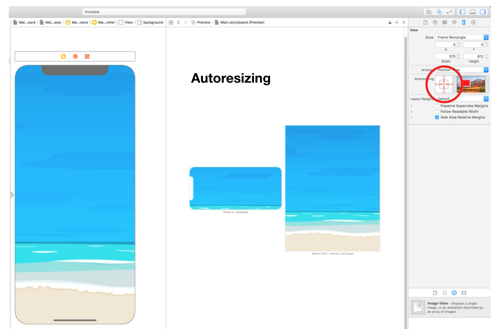


## Stackviews

StackViews te permite agrupar multiples Views, podemos hacer flexible Layouts.

Podemos agregar margenes internos a un UIView con **Content Insets**.

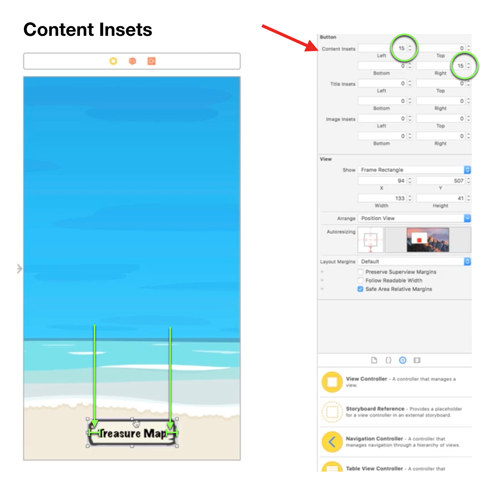

Los StackViews tienen por default dos configuraciones, Horizontal y Vertical, la idea de un Stack es agrupar, por lo tanto no debe tener fondo.

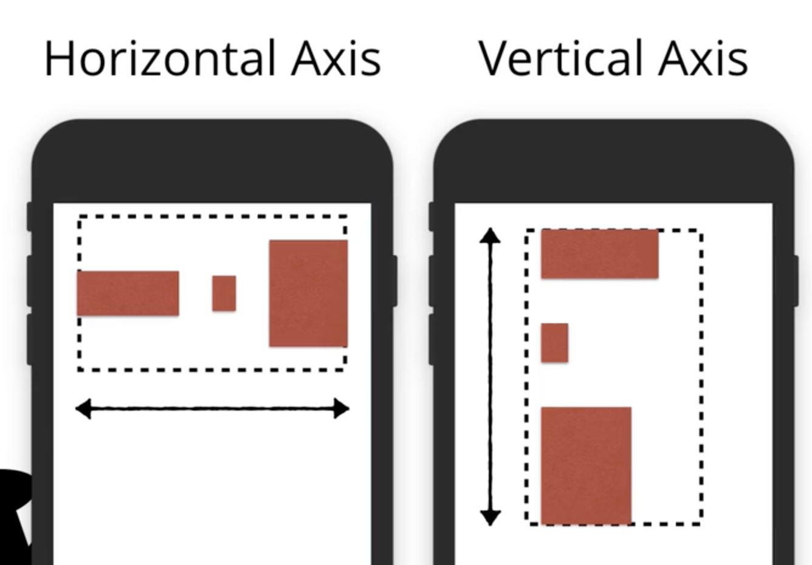

Dentro del StackView tenemos las siguientes propiedades:

- Spacing, el espacio entre elementos.
- Distribution, determina como se posicionan los Views en los Axis.
- Alignment, la manera en la que vamos a alinearlos, por ejemplo, alinearlos verticalmente o respecto al Top margin.

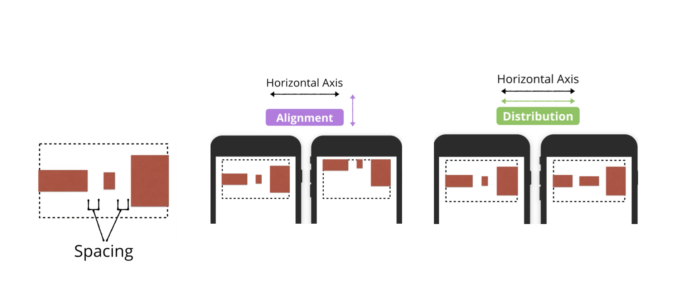

### Stackviews, Intrinsic content size

Por ejemplo el color azul no le importa el tamaño de su contenedor, o bien una imagen que no sabe las dimesiones de su contenedor.
Intrinsic Content Size, es el tamaño necesaro para ajustarse exactamente a su contenedor.

Supongamos que tenemos dos Labels, cada Label con un Texto mas largo que el otro, ¿Quien decide cual se va a comprimir y cuál no?,  **Autolayout**.

Para ello tenemos dos conceptos, **Content Hugging: No crezcas** y **Compression Resistance: No te encojas (shrink)**.

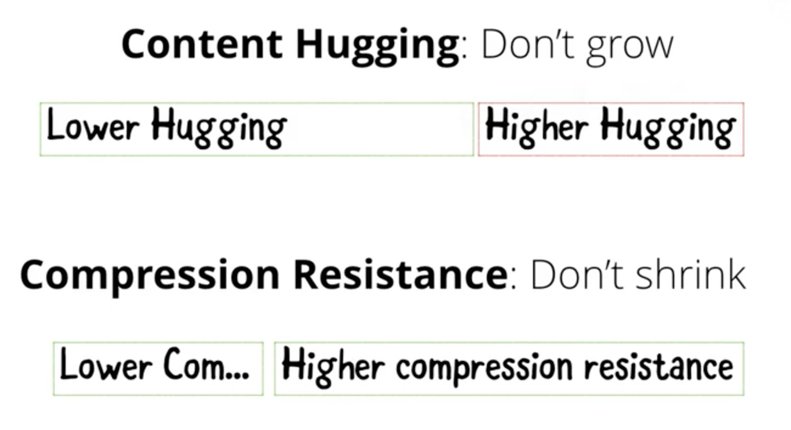

### Stackviews, Alingment

Son stackviews dentro de otro stackview. Dentro de las opciones de Alingment podemos alinear elementos por el Texto contenido en cada UIView (Baseline).

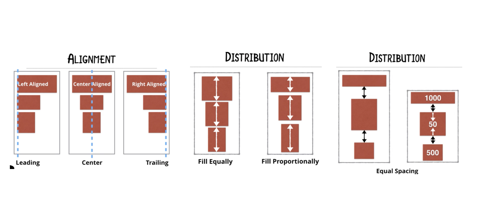


