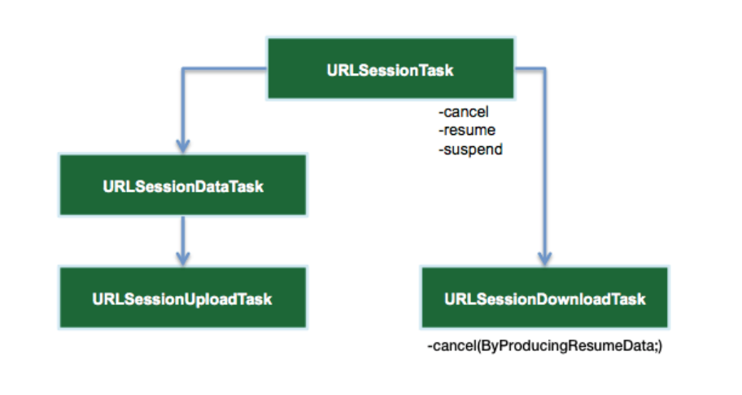

# URLSession Tutorial

## Getting Started

Apple provides `URLSession`, a complete networking API for uploading and downloading content via HTTP.

**URLSession** is technically both a *class* and a *suite of classes* for handling *HTTP/HTTPS-based* requests:

`URLSession` is the key object responsible for sending and receiving HTTP requests. You create it via `URLSessionConfiguration`, which comes in three flavors:

* `.default`: Creates a default configuration object that uses the disk-persisted global cache, credential and cookie storage objects.
*  `.ephemeral`: Similar to the default config. except that all session-related data is stored in memory. Think of this as a "private" session.
*  `.background`: Lets the session perform upload or download tasks in the background. Transfers continue even when the app itself is suspended or terminated by the system.


`URLSessionConfiguration` also lets you configure session properties such as **timeout values**, caching policies and additional **HTTP headers**.

`URLSessionTask` is an abstract class that denotes a task object. A session creates one or more tasks to fetching, downloading or uploading data. You can also suspend, resume and cancel tasks.




Three types of concrete session tasks:

* `URLSessionDataTask`: For **HTTP Get requests** to retrieve data from servers to memory.
*  `URLSessionUploadTask`: Use this task to **upload a file** from disk to a web service, typically via a **HTTP POST or PUT**.
*  `URLSessionDownloadTask`: Use this task to download a file from a remote service to a temporary file location. Can also *pause* for future resumption.

Generally, `URLSession` returns data in two ways: via a **completion handler when a task finishes**,  either successfully or with an error, or by **calling methods on a delegate** that you set when creating the session.

## Ejemplo

```Swift
func getSearchResults(searchTerm: String, completion: @escaping QueryResult) {
  // 1
  dataTask?.cancel()
  // 2
  if var urlComponents = URLComponents(string: "https://itunes.apple.com/search") {
    urlComponents.query = "media=music&entity=song&term=\(searchTerm)"
    // 3
    guard let url = urlComponents.url else { return }
    // 4
    dataTask = defaultSession.dataTask(with: url) { data, response, error in
      defer { self.dataTask = nil }
      // 5
      if let error = error {
        self.errorMessage += "DataTask error: " + error.localizedDescription + "\n"
      } else if let data = data,
        let response = response as? HTTPURLResponse,
        response.statusCode == 200 {
        self.updateSearchResults(data)
        // 6
        DispatchQueue.main.async {
          completion(self.tracks, self.errorMessage)
        }
      }
    }
    // 7
    dataTask?.resume()
  }
}
```


