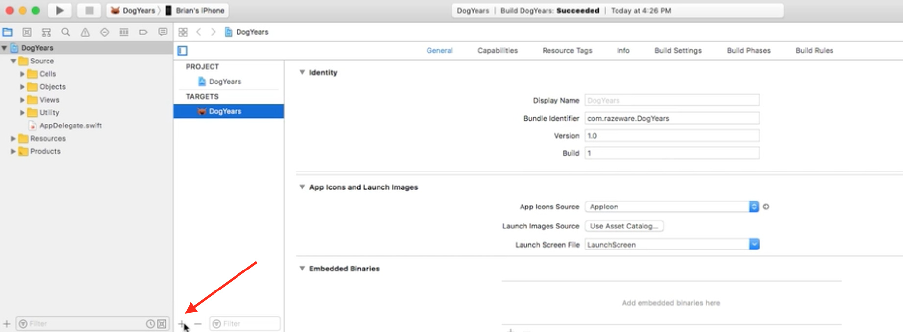
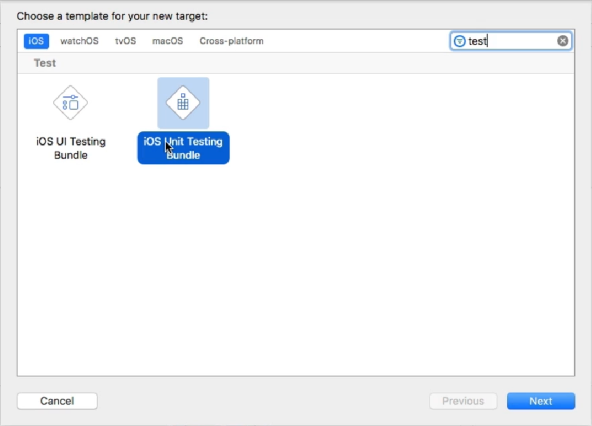
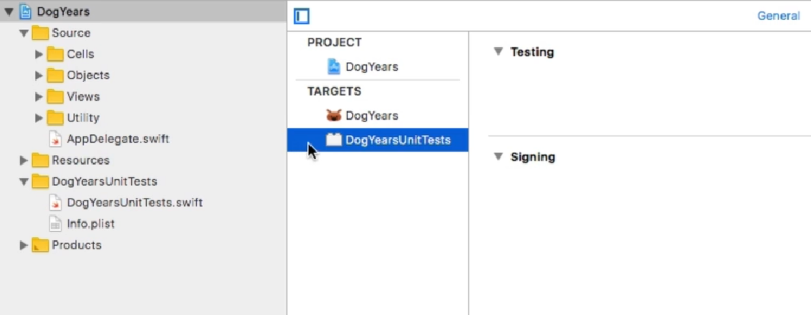
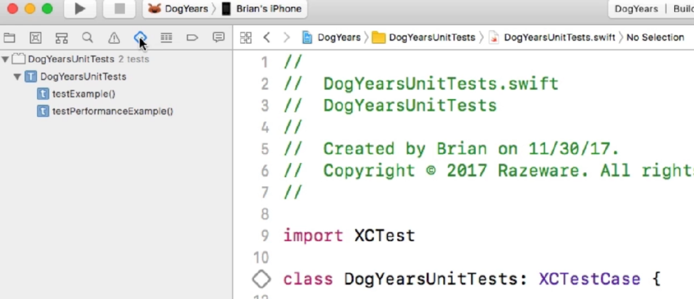
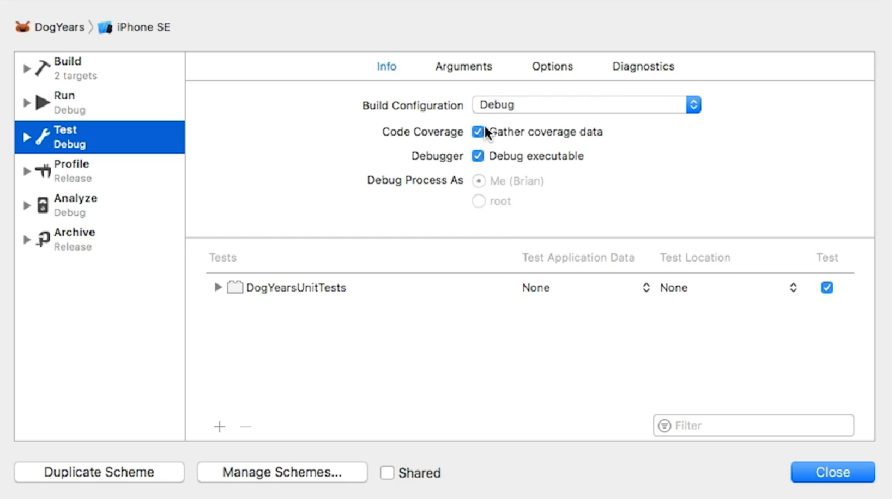
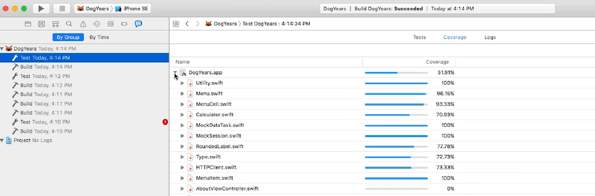
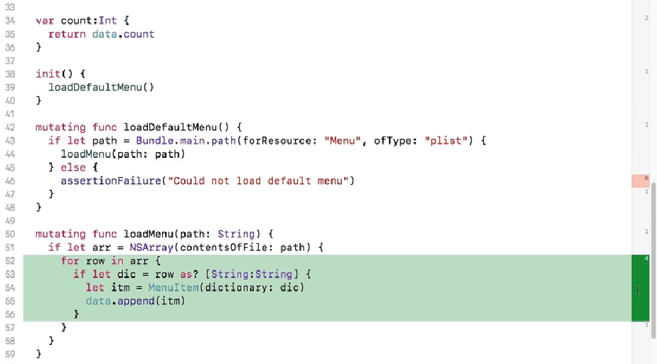
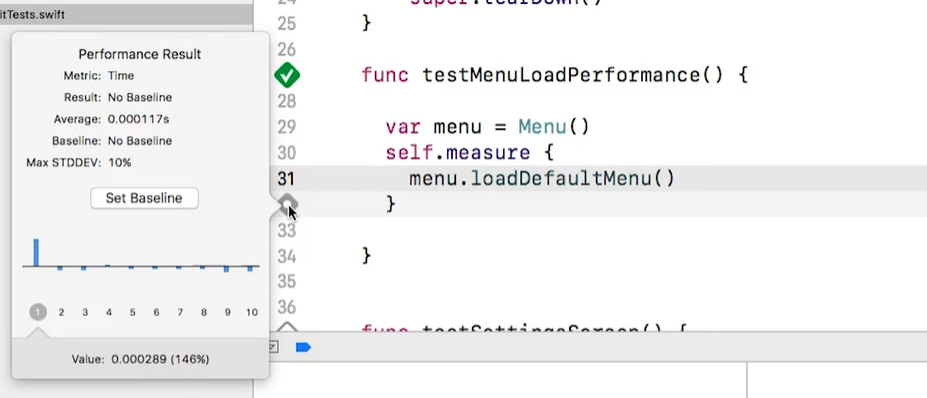
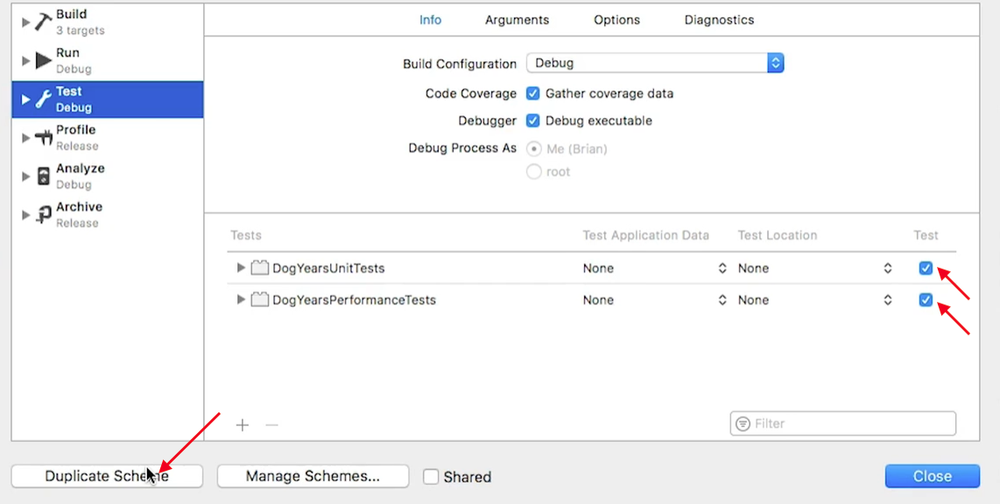
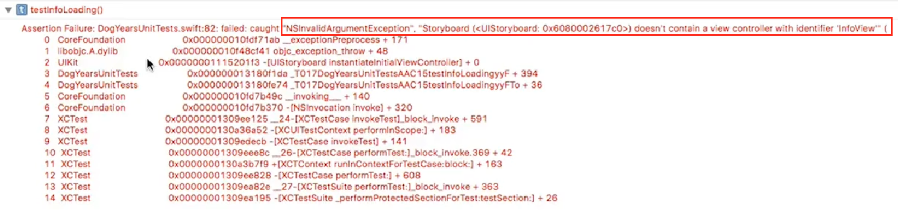

# Unit Testing

Para comenzar a utilizar *Unit Testing*, primero:

Agregamos un nuevo **TARGET** al proyecto.





El código del *Unit Testing* es una subclase de `XCTestCase`:



Si nos pasamos al icono de Tests, vemos que hay un *DogYearsUnitTests*, pero podemos tener muchas clases de testing en el mismo *Test bundle*.

## Importing Modules

Si vas a hacer testing de la clase `DogYears` se debe importar el *module* al *Unit Test Target*, recuerda que las clases tienen elementos *Open, Public e Internal* con la palabra `@testable` podemos acceder a elementos de tipo *Internal* desde otros modulos, sin embargo, no podemos acceder a elementos de tipo *Private* desde otros modulos, solo desde su propia clase.

Para **importar el modulo (clase)** en el *Unit Test*:

``` Swift
import XCTest
@testable import DogYears //<-----

class DogYearsUnitTest: XCTestCase {
	...
}
```

## Structure

Tenemos algunas funciones en el UnitTest por defecto (*boilerplate code*), entre ellas se encuentra **setUp()** el cuál crea el ambiente para el *Unit Test* y **tearDown()** que se ejecuta después de invocar al método de testing.

``` Swift
override func setUp(){
	super.setUp()
	// Put setup code here. This method is called before the invocation of each test method in the class.
}

override func tearDown(){
	super.tearDown()
	// Put teardown code here. This method is called after the invocation of each test method in the class.
}

```

Los métodos o funciones que se ejecutarán por el *Unit Test* deben iniciar con la palabra **test** por ejemplo:

``` Swift
func testExample(){
	...
}
```

Dentro del *Unit Test* tenemos algunas funciones que nos ayudaran a verificar nuestros resultados, como por ejemplo **XCTAssert**, checa que la condicion especificada sea cierta.

``` Swift
let calc = Calculator()

func testAdd(){
	let result = calc.evaluate(op:"+", arg1: 2.0, arg2: 9.0)
	XCTAssert(result == 11.0, "Calculator add operation failed")
}

```

## Asynchronous

Caso de uso: "Obtener datos de un WebService".
Queremos ver si el texto cambia después de hacer una petición HTTP.

1.- Crear una instancia del Storyboard y del ViewController para ver si hay diferencias de texto:

``` Swift
//Instance of Storyboard
let sb = UIStoryboard(name: "Main", bundle:nil)
XCTAssertNotNil(sb, "Could not instiantiate storyboard for Info View content loading")

//Instance of ViewController
guard let vc = sb.instantiateViewController(withIdentifier: "InfoView") as? InfoViewController else {
	XCTAssert(false, "Could not instiantiate view controller for Info View content loading")
	return
}

//set content
let txt1 = vc.txtInfo.text
vc.loadContent() //HTTP Request
let txt2 = vc.txtInfo.text
XCTassert(txt1 != txt2, "Loading content for Info View did not change text")
```

El código de `loadContent()` es Asyncrono, ya que realiza una petición HTTP, asignaremos 5 segundos de espera, suficientes para recibir una respuesta del servidor.

`XCTWaiter.wait` sirve para poner un *delay*, basicamente diciendole que espere cierto tiempo y chece por un valor que se cumpla.

```Swift
guard let txt = vc.txtInfo.text else {
	XCTAssert(false, "Could not get initial text content for Info View content loading")
	return
}

vc.loadContent() //HTTP Request
let pred = NSPredicate(format: "text != %@", txt)
let exp = expectation(for: pred, evaluatedWith: vc.txtInfo, handler:nil)
let result = XCTWaiter.wait(for:[exp], timeout:5.0) //<- Wait 5 seconds
XCTAssert(result == XCTWaiter.Result.completed, "Loading content for Info View did not change text")
```

Revisemos `loadContent()`, vemos que en su código tenemos un *closure* de *data* y *error*, con Unit Test podemos usar esta petición directamente sin crear una instancia del Storyboard.

``` Swift
func loadContent(){
	let url = "https://raw.githubusercontent.com/..."
	HTTPClient.shared.get(url: url) {(data, error) in
		//Was there an error?
		if let error = error{
			NSLog("Error: \(error)")
			return
		}

		//No error, was there data?
		if let data = data {
			...
		}
	}
}
```

Reemplacemos el código anterior con este:
Ojo, el Test parece haber funcionado, ya que ejecuta bien el código pero como es una llamada Async no revisa si en realidad hay *data*.

```Swift
let url = "http:...."
HTTPClient.shared.get(url: url){ (data, error) in 
		XCTAssertNil(error, "There was an error loading the InfoView content")
		XCTAssertNotNil(data, "No data was received from the server for InfoView content")
}
```

Para checar si el callback returns data 

``` Swift
//Agregamos un nuevo property
var resData: Data? = nil

//la función se modificaria asi:
func testInfoLoading() {

	let url = "http://..."
	HTTPClient.shared.get(url: url) {
		(data, error) in 
			self.resData = data
	}
	
	//checamos si hay data:
	let pred = NSPredicate(format: "resData != nil")
	let exp = expectation(for:pred, evaluateWith: self, handler:nil)
	let res = XCTWaiter.wait(for[exp], timeout:5.0)
	if res == XCTWaiter.Result.completed {
		XCTAssertNotNil(resData, "No data received from the server for InfoView content")
	}else{
		XCTAssert(false, "the call to get the URL ran into some other error")
	}

}
```

## Mocking

The mock object:
Instead of a production code, you can use an standing object to simulate all necessary data locally, the fake object should be the equivalent of production class.

Another class handle the fetching.
The Mock Object mimics the caracteristics of URLSession in testing.

Basicamente, es usar *Protocols* con *HTTP Requests*

```Swift
protocol URLSessionDataTaskProtocol {
	func resume()
}	

protocol URLSessionProtocol {
  func dataTask(with request: URLRequest, completionHandler: @escaping (Data?, URLResponse?, Error?) -> Void) -> URLSessionDataTaskProtocol
}

extension URLSession: URLSessionProtocol {
  
  func dataTask(with request: URLRequest, completionHandler: @escaping (Data?, URLResponse?, Error?) -> Void) -> URLSessionDataTaskProtocol {
    let task = dataTask(with: request, completionHandler: completionHandler) as URLSessionDataTask
    return task as URLSessionDataTaskProtocol
  }
}

extension URLSessionDataTask: URLSessionDataTaskProtocol {
	//nothing here, just conforming the protocol
}

```

```Swift
class HTTPClient {
	
	private let session: URLSessionProtocol
	
	init(session: URLSessionProtocol) {
		self.session = session
	}
	
	// MARK:- Public Methods
	func get(url: String, callback: @escaping (_ data: Data?, _ error: Error?)->Void ) {
		guard let link = URL(string: url) else {
			let error = NSError(domain: "URL Error", code: 1, userInfo: nil)
			callback(nil, error)
			return
		}
		let request = URLRequest(url: link)
		let task = session.dataTask(with: request) {(data, response, error) in
			callback(data, error)
		}
		task.resume()
	}
}
```

```Swift
func loadContent() {
	let url = "https://raw.githubusercontent.com/FahimF/Test/master/DogYears-Info.rtf"
    let session = URLSession.shared
    let client = HTTPClient(session: session)
    
		client.get(url: url) {(data, error) in
			// Was there an error?
			if let error = error {
				NSLog("Error: \(error)")
				return
			}
			
			// No error, was there data?
			if let data = data {
				guard let txt = try? NSAttributedString(data: data, options: [NSAttributedString.DocumentReadingOptionKey.documentType: NSAttributedString.DocumentType.rtf], documentAttributes: nil) else { return }
				DispatchQueue.main.async {
					self.txtInfo.attributedText = txt
			}
		}
	}
}
```

Todo bien hasta aquí, ya tenemos los Request con Protocols, ahora crearemos el **Unit Testing**. Primero crearemos dos clases *mocking* para apoyarnos en el testing.

```Swift
class MockSession: URLSessionProtocol {
  func dataTask(with request: URLRequest, completionHandler: @escaping (Data?, URLResponse?, Error?) -> Void) -> URLSessionDataTaskProtocol {
    completionHandler(Data(), nil, nil)
    return MockDataTask()
  }
}

class MockDataTask: URLSessionDataTaskProtocol {
  func resume() {
  }
}
```

En el UnitTest, escribimos el sig. código:

``` Swift
func testInfoLoading() {
    
      let url = "https://raw.githubusercontent.com/FahimF/Test/master/DogYears-Info.rtf"
     
      let session = MockSession()
      let client = HTTPClient(session: session)
      client.get(url: url) {
        (data, error) in
          self.resData = data
      }
      let pred = NSPredicate(format: "resData != nil")
      let exp = expectation(for: pred, evaluatedWith: self, handler: nil)
      let res = XCTWaiter.wait(for: [exp], timeout: 5.0)
      if res == XCTWaiter.Result.completed {
        XCTAssertNotNil(resData, "No data recived from the server for InfoView content")
      } else {
        XCTAssert(false, "The call to get the URL ran into some other error")
      }  
    }
```
 
## Reporting Xcode features
 
 Te dice que partes de tu código estan en Unit Test y que partes no lo estan.
 
 **CodeCoverage**, en los Profiles, seleccionamos la opción dentro de Test. Ejecutamos todos los Test `Cmd+U`.



Una vez finalizado el Run del Test, vamos a los resultados del Testing, buscamos la pestaña **Coverage** y vemos los resultados.



Al **seleccionar algun archivo swift** que no este al **100%**, se puede ver en su código que  hay algunos indicadores en **ROJO** (que no tienen codigo de Unit Test) y otros indicadores que al pasar el cursor sale en **VERDE** (que ya tienen código de Unit Test).




## Testing a View Controller

``` Swift
func testSettingsScreen(){
	let sb = UIStoryboard(name: "Main", bundle: nil)
	XCTAssertNotNil(sb, "Could not instantiate storyboard")
	let vc = sb.instantiateViewController(withIdentifier: "SettingsView") as? SettingsViewController
	_ = vc?.view // <- solo para usar el vc
}
```

## Performance

Te permite medir que tan rapido se ejecuta un código. Se especifica un *baseline*, si se rebasa esta linea, entonces se dice que el test fracasó.

```Swift
func testPerformanceExample() {
	self.measure {
	
	}
}
```

Ejemplo, **load a menu**. Se observa que al ejecutar el test obtenemos datos de performance en un *popup*, aqui tambien podemos editar el *baseline* o referencia de tiempo (si es óptimo o no).



## Multiples Target Schemes

Se pueden correr diferentes Test en distintos **Schemes**. Agregamos un nuevo **Target**, un nuevo **Unit Testing Bundle**. En su nuevo *Boiler Plate code*, reescribimos el código que nos interesa dentro de la función de `testPerformance()`.

Para tener multiples **Targets** es necesario seleccionar que Test van a ejecutar. Para ello podemos duplicar el *Scheme* y elegir los Test que deseemos.



**Nota:** Es recomendable reiniciar Xcode antes de probar los Targets.

## Error

Un error común si el *ID* identifier del *ViewController* no esta asignado en el Storyboard, `NSInvalidArgumentException`.




## Glosario

[URLSession Tutorial](https://github.com/richimf/CodigosSwift/blob/master/URLSessionTask/URLSession%20Tutorial.md)

[@escaping](https://cocoacasts.com/what-do-escaping-and-noescape-mean-in-swift-3), If a closure is passed as an argument to a function and it is invoked after the function returns, the closure is escaping. It is also said that the closure argument escapes the function body.

[NSPredicate](https://nshipster.com/nspredicate/),
NSPredicate is a Foundation class that specifies how data should be fetched or filtered


**XCTAssert**, Asserts that an expression is true.

**XCTAssertNotNil**, Asserts that an expression is not `nil`.

**XCTWaiter**, [Waits](https://developer.apple.com/documentation/xctest/xctwaiter) for a group of expectations to be fulfilled.


